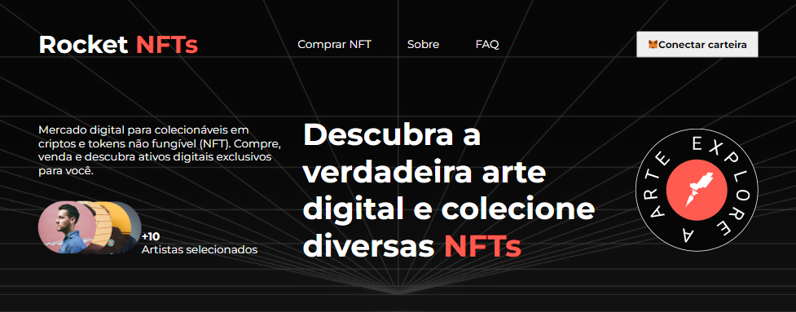

# Rocket NFT

Rocket NFT é um mercado digital para colecionáveis em criptos e tokens não fungíveis (NFTs). Compre, venda e descubra ativos digitais exclusivos. Com mais de 10 artistas selecionados, você pode descobrir a verdadeira arte digital e colecionar diversas NFTs.

> ## ✅ Características
- Navegação fácil com menus para comprar NFT, sobre, FAQ e conectar a carteira
- Galeria de arte com 6 imagens de astronautas
- Conteúdo explicativo e atraente sobre o mercado de NFTs

> ## 🛠 Tecnologias utilizadas
HTML
CSS
Google Fonts

> ## ⚙️ Como usar
Clique <code>[neste link](https://nathanmarques2001.github.io/Rocket-NFT/)</code>, ou clone este repositório para o seu computador. Abra o arquivo HTML em um navegador web para visualizar o site. 

>## ✉️ Contato

### nathanbrandao1@gmail.com
